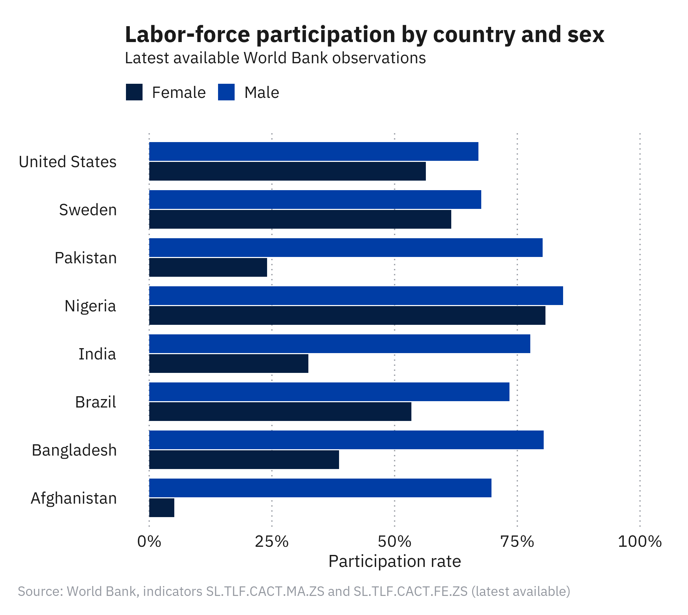
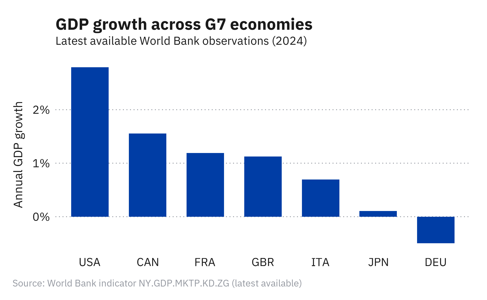
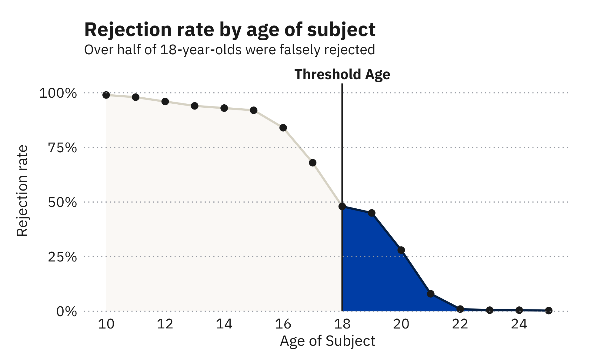
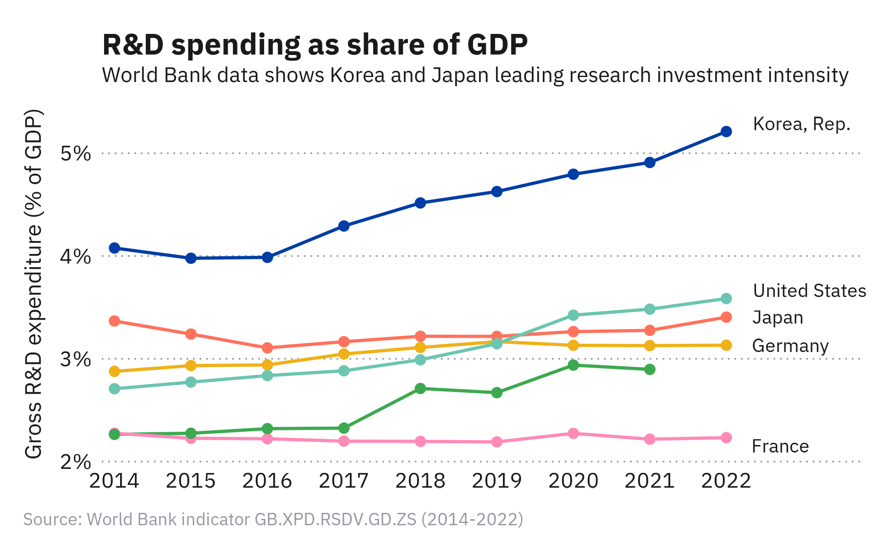
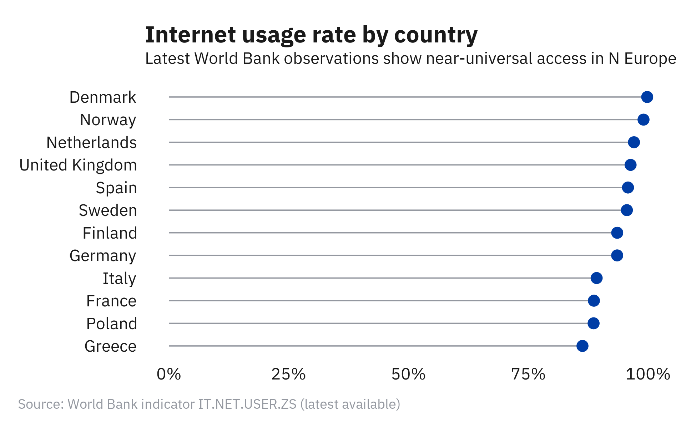
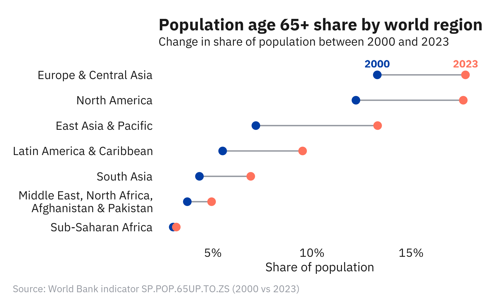
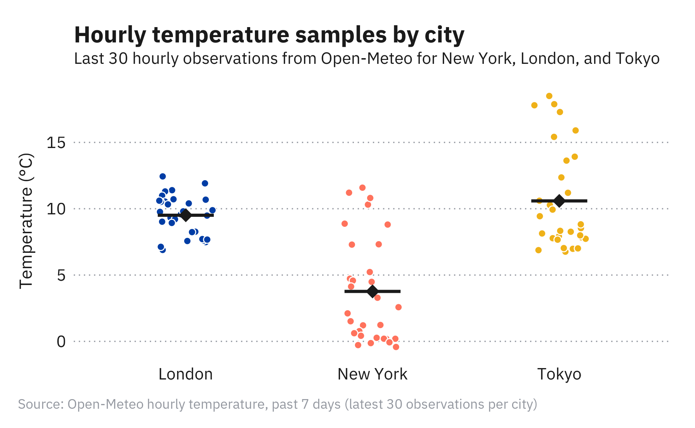

# k88chart

An editorial ggplot2 theme for clean, publication-ready charts. Sized for LaTeX documents (6.5 x 4in at 300 DPI) with IBM Plex Sans.

## Setup

```r
source("theme_k88chart.R")
```

Requires `ggplot2` and `showtext` (fonts are loaded automatically from Google Fonts).

## Usage

```r
ggplot(data, aes(x = x, y = y)) +
  geom_col() +
  scale_fill_k88() +
  theme_k88chart()

k88_save("chart.png", p)
```

## Color palettes

`scale_fill_k88()` and `scale_color_k88()` accept a `palette` argument:

| Palette | Usage | Colors |
|---------|-------|--------|
| `"default"` | Categorical (up to 10 groups) | blue, red, yellow, teal, green, pink, purple, ltblue, brown, gray |
| `"blues"` | Sequential blue (up to 4 levels) | dark navy to light blue |
| `"reds"` | Sequential red (up to 4 levels) | dark red to light salmon |

Individual colors are also available as variables: `k88_blue`, `k88_red`, `k88_yellow`, etc.

Sequential palettes can be indexed directly: `k88_palette_blues[1]` (darkest) through `[4]` (lightest). Same for `k88_palette_reds` and `k88_palette_neutral`.

## Helpers

### `annotate_outlined_text(...)`

Like `annotate("text", ...)` but with a white box behind the text to mask gridlines and other elements. Use for fixed-position labels.

```r
annotate_outlined_text(x = 18, y = 100, label = "Threshold",
                       fontface = "bold", size = 4, color = k88_black)
```

### `k88_save(filename, plot, ...)`

Wrapper around `ggsave` with LaTeX-friendly defaults: 6.5 x 4 inches, 300 DPI, white background.

```r
k88_save("chart.png", p)
k88_save("tall_chart.png", p, height = 5)
```

## Data

Example charts read from CSV files in `data/`.

Refresh them from live APIs with:

```r
Rscript data/fetch_api_data.R
```

The threshold-age line/area example intentionally keeps its original values and is stored in `data/line-area.csv`.

## Examples

Regenerate all examples with `plz examples` or `Rscript example.R`.

### Horizontal grouped bar chart (`examples/bar.R`)



### Vertical bar chart with short labels (`examples/bar-vertical.R`)



### Line area chart (`examples/line-area.R`)



### Multi-line chart with inline labels (`examples/lines.R`)



### Cleveland dot plot (`examples/cleveland.R`)



### Dumbbell chart (`examples/dumbbell.R`)



### Strip/jitter chart (`examples/strip.R`)


